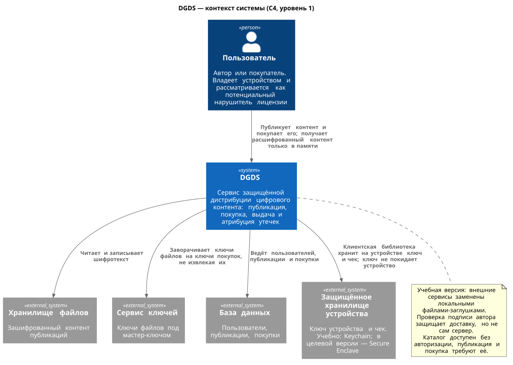

# DGDS

[](https://github.com/plushcube/dgds/actions/workflows/build.yml)

Сервис защищённой дистрибуции цифрового контента: автор публикует файл, покупатель приобретает доступ и читает содержимое, но не уносит его с собой — копия бесполезна вне устройства покупателя, а утёкшая копия указывает на покупку, из которой она произошла.

В рамках учебного проекта реализована общая архитектура и ядро обработки и дистрибуции файлов, а работа с базой данных, управление доступом и распределённые сервисы заменены локальными заглушками.

## Для чего это

Там, где цифровой товар отдают копией, а не показывают по подписке, продавец теряет связь с экземпляром. DGDS возвращает её: контент шифруется, ключ выдаётся вместе с покупкой и привязывается к устройству, а каждый выданный экземпляр несёт невидимую метку с идентификатором покупки и кодом аутентичности, посчитанным на серверном секрете. Схема рассчитана на случаи, когда важно не предотвратить копирование любой ценой, а сделать обход дороже выгоды и уметь разобрать инцидент.

## Как это устроено



Пользователь работает с приложением-хостом, которое встраивает клиентскую библиотеку. Библиотека обращается по HTTPS к серверу и хранит ключ устройства и чек в защищённом хранилище платформы. Зашифрованный контент, ключи файлов и метаданные лежат в отдельных хранилищах; открытый текст существует только в памяти клиента.

Диаграммы в `docs/architecture`: [контекст](docs/architecture/01-context.svg) · [контейнеры](docs/architecture/02-containers.svg) · [компоненты сервера](docs/architecture/03-components-server.svg) · [компоненты клиента](docs/architecture/03-components-client.svg) · последовательности: [регистрация и каталог](docs/architecture/04-sequence-sign-in.svg) · [публикация](docs/architecture/04-sequence-publish.svg) · [покупка](docs/architecture/04-sequence-buy.svg) · [получение контента](docs/architecture/04-sequence-fetch.svg) · [отказы](docs/architecture/04-sequence-refusals.svg).

## Возможности

- **Публикация.** Автор загружает текстовый файл. Сервер проверяет дубликат по отпечатку канонической формы, шифрует контент ключом файла и хранит ключ отдельно от шифротекста. Подпись автора покрывает отпечаток и имя автора, поэтому подмена контента на пути доставки обнаруживается покупателем.
- **Покупка.** Покупатель получает уникальный ключ покупки, которым обёрнут ключ файла; обёртка привязана к ключу устройства покупателя. Повторный запрос покупки не создаёт новую, а выпуск копии чека для нового устройства не меняет дату покупки.
- **Выдача.** Пакет выдаётся только владельцу покупки. В выдаваемый экземпляр встраивается метка с идентификатором покупки и кодом аутентичности, а клиент до расшифровки проверяет отпечаток контента и подпись автора.
- **Работа с открытым текстом.** Расшифровка идёт только в память, буфер освобождается после передачи потребителю, на устройство открытый текст не попадает.
- **Списки.** Каталог доступен без авторизации; список купленного, список публикаций автора с числом продаж и каталог отдаются окном: смещение, размер окна и общее число записей.
- **Атрибуция утечек.** По утёкшей копии определяется покупка: ядро проверяет целостность и подлинность метки и восстанавливает покупателя, публикацию и дату. Определение доступно отдельной операцией `/attribute` для авторизованного пользователя.

## Пределы и защита от злоупотреблений

- **Размеры.** Контент публикации — не больше 4 МиБ; имя пользователя, название публикации и имя файла — не больше 256 байт. Значения сверх предела отвергаются разбором, а отказ не оставляет следов в хранилищах.
- **Окно списков.** Смещение по умолчанию 0, размер окна — 20, максимум — 100. Отрицательные, нечисловые и превышающие предел значения отвергаются ошибкой `request_malformed`.
- **Предел частоты.** По умолчанию 100 вызовов в минуту: на адрес — для каждого запроса, отдельно на пользователя — для публикации и выдачи пакета. Ключ `--rate-limit 0` отключает предел; превышение возвращает `rate_limit_exceeded` (HTTP 429). Каталог, вход и список покупок под пер-пользовательский предел не попадают.
- **Тело запроса и ответа.** Запрос ограничен пределом контента с небольшим запасом, ответ — с восьмикратным запасом: выданный пакет несёт метку покупки, а шифротекст передаётся ещё и в шестнадцатеричном виде.
- **Одна сессия на пользователя.** Вход выдаёт учётные данные на ограниченное время, а повторный вход аннулирует прежние. Сессии живут в памяти и не переживают перезапуск сервера.
- **Короткий текст и метка.** Метка не помещается в текст короче 136 значимых символов: выдача такого контента проходит без метки, и определить покупку по утёкшей копии уже не получится. Это свойство канала метки, оговорённое в модели угроз, а не ошибка.
- **Метка — показатель, а не абсолютное доказательство.** Код аутентичности подтверждает, что метку собрал сервер на своём секрете, поэтому подделать её посторонний не может. Но получатель может удалить метку из своей копии, а сговор получателей — вычислить различия и устранить их: определение опирается на несколько согласованных вхождений и подтверждает принадлежность копии покупке, а не вину владельца.

## Требования к системе сборки

| Что              | Версия и примечание                                                                                        |
| ---------------- | ---------------------------------------------------------------------------------------------------------- |
| CMake            | 3.28 или новее                                                                                             |
| Компилятор C++23 | проверено на Apple clang 21 и на компиляторе из образа ubuntu 24.04                                        |
| OpenSSL 3        | библиотека и заголовки: `libssl-dev` в Linux, `openssl@3` в macOS                                          |
| Сеть при сборке  | зависимости скачиваются через FetchContent: cpp-httplib v0.56.0, nlohmann/json v3.12.0, googletest v1.17.0 |

Для проверок нужны ещё три инструмента:

| Что          | Примечание                                            |
| ------------ | ----------------------------------------------------- |
| clang-format | проверено на 23.1.2                                   |
| cmake-format | 0.6.13                                                |
| python3      | нужен драйверу замеров `tools/measure_performance.py` |

Docker нужен только для сборки образа и отрисовки диаграмм; для сборки, тестов и проверок он не требуется.

### Ограничения платформ и версия

- **Обрабатываются только текстовые файлы.** Канал метки определён для текста; произвольные форматы могут быть поддержаны отдельно - для этого требуются собственные реализации под каждый формат.
- **Ключ устройства и чек.** Пример и тесты используют файловую заглушку устройства, работающую везде. Реализация на Keychain собирается и тестируется только на macOS. В реальном продукте для хранения ключей нужно использовать Secure Enclave, это пока не реализовано.
- **Заглушки вместо внешних сервисов.** Выбор `DGDS_BACKEND=stubs` собирает файловые реализации портов. Набор `services` для реальных хранилищ объявлен, но не реализован — сборка с ним останавливается с ошибкой.
- **Аутентификация по только имени, без пароля.** Управление доступом заменено заглушкой, поэтому выставлять сервер в сеть без внешнего терминатора TLS и слоя аутентификации не следует.
- **Производительность каталога зависит от размера раздела.** Записи окна читаются целиком только для самого окна, но перечисление и сортировка имён остаются линейными по числу записей — это свойство файловой заглушки, которое в реальном применении снимает индекс БД. Измерения и модель — в `docs/performance.md`.

## Сборка

```sh
cmake -B .build
cmake --build .build --parallel
ctest --test-dir .build --output-on-failure
```

Полная проверка одной командой — формат C++ и CMake, свежесть рендеров диаграмм, целостность слоёв, сборка и тесты:

```sh
./self_check.sh
```

### Опции сборки

`cmake -B .build` принимает две переменные:

| Переменная        | По умолчанию | Что делает                                                    |
| ----------------- | ------------ | ------------------------------------------------------------- |
| `WITH_TESTS`      | `ON`         | собирать ли тесты                                             |
| `PATCH_VERSION`   | `1`          | номер сборки в версии продукта `0.0.<номер>`                  |
| `DGDS_SANITIZER`  | `none`       | санитайзеры сборки: `address`, `undefined`, `thread` или список через запятую |

Сборка под санитайзерами — отдельным каталогом, чтобы не смешивать с обычной:

```sh
cmake -B .build-asan -DDGDS_SANITIZER=address,undefined
cmake --build .build-asan --parallel
ctest --test-dir .build-asan --output-on-failure
```

На Linux к ASan подключается LeakSanitizer, а `thread` собирается отдельной сборкой: вместе с ASan его включить нельзя.

Набор реализаций портов выбирается переменной окружения `DGDS_BACKEND`: `stubs` (по умолчанию) собирает файловые заглушки, набор `services` объявлен, но не реализован — сборка с ним останавливается с ошибкой.

### Пакеты

Цель `package` собирает пакет с обоими приложениями, документацией и `QUICKSTART.md`. На Linux получаются `dgds_<версия>_<архитектура>.deb` и `dgds-<версия>-linux-<архитектура>.tar.gz`, на macOS — `.tar.gz`; рядом кладутся контрольные суммы `*.sha256`.

```sh
cmake --build .build --target package
```

Пакет разворачивается и запускается без прав администратора: распакованный `.tar.gz` или установленный `.deb` даёт `dgds-server` и `dgds-client`, которыми поднимается стенд из `packaging/QUICKSTART.md`.

### Контейнер

Сервер поставляется образом: многостадийная сборка на Ubuntu 24.04, непривилегированный пользователь, том `/data` и самоподписанный сертификат, который выпускается при первом запуске.

```sh
docker build --tag dgds:local --build-arg PATCH_VERSION=1 .
docker compose up --detach --wait
```

Релиз по тегу `v0.0.<номер>` собирает пакеты, прикладывает их к выпуску вместе с контрольными суммами и публикует образ сервера в GitHub Container Registry как `ghcr.io/plushcube/dgds`. Образ, запуск, работа с сертификатом и раскладка тома описаны в `docs/deployment.md`.

## Запуск и проверка вживую

Стенд состоит из двух процессов: сервер и клиент-пример. Сервер печатает адрес и отпечаток самоподписанного сертификата, клиент этому сертификату доверяет и закрепляет его ключ.

```sh
.build/bin/dgds-server --root /tmp/dgds-stand --port 0
```

Порт сервер печатает сам в строке «Слушаю». Если при запуске сервера указан порт 0, будет выбран случайный свободный. Дальше нужно запустить клиентское приложение, подставив номер порта сервера:

```sh
.build/bin/dgds-client --certificate /tmp/dgds-stand/tls/server.crt --port $PORT --device /tmp/dgds-stand/device
```

Клиент регистрирует автора и покупателя, публикует файл (по умолчанию встроенный образец, свой задаётся ключом `--text`), печатает каталог, покупает файл и выводит расшифрованное содержимое. В выводе видны вставленные метки, каноническая форма выведенного текста совпадает с исходной, а открытого текста не остаётся ни в каталоге сервера, ни на устройстве.

### Ключи запуска

Обе программы печатают справку по `--help`, а версию продукта — по `--version`; сервер в версии печатает ещё и набор адаптеров. Справка всегда доступна и из собранного бинарника.

| `dgds-server`  | По умолчанию                  | Что делает                                                    |
| -------------- | ----------------------------- | ------------------------------------------------------------- |
| `--root`       | `~/.dgds`                     | каталог данных сервера                                        |
| `--master-key` | `<каталог данных>/master.key` | ключ хранилища ключей                                         |
| `--host`       | `127.0.0.1`                   | адрес прослушивания                                           |
| `--port`       | `8443`                        | порт HTTPS; `0` — любой свободный                             |
| `--rate-limit` | `100`                         | вызовов публикации и выдачи в минуту на пользователя; `0` — без предела |

| `dgds-client`   | По умолчанию       | Что делает                                                       |
| --------------- | ------------------ | ---------------------------------------------------------------- |
| `--certificate` | —                  | сертификат сервера; обязателен, им проверяется и закрепляется соединение |
| `--host`        | `127.0.0.1`        | адрес сервера                                                    |
| `--port`        | `8443`             | порт сервера                                                     |
| `--device`      | `~/.dgds-device`   | каталог устройства: ключ и чеки                                  |
| `--text`        | встроенный образец | файл для публикации                                              |

### Проверка протокола напрямую

Те же сценарии можно пройти по HTTPS, без клиентской библиотеки. Понадобится `curl` и путь к сертификату стенда. Ниже `$PORT` — порт из строки «Слушаю». Во всех запросах и ответах присутствует версия протокола, а списки отдаются окном.

Операции принимаются POST-запросом, тело — объект JSON (маршрут один на все пути, поэтому параметров в URL нет):

| Операция               | Авторизация | Поля запроса кроме `version`                              | Предел частоты |
| ---------------------- | ----------- | --------------------------------------------------------- | -------------- |
| `/register`            | нет         | `name`                                                    | адрес          |
| `/login`               | нет         | `name`                                                    | адрес          |
| `/catalog`             | нет         | `offset`, `limit`                                         | адрес          |
| `/publish`             | да          | `credentials`, `draft{title,file_name,content}`, `author_key`, `signature` | пользователь |
| `/author-publications` | да          | `credentials`, `offset`, `limit`                          | адрес          |
| `/buy`                 | да          | `credentials`, `publication_id`, `device_key`             | —              |
| `/purchases`           | да          | `credentials`, `offset`, `limit`                          | адрес          |
| `/restore-receipt`     | да          | `credentials`, `purchase_id`, `device_key`                | —              |
| `/context-identity`    | да          | `credentials`, `context_id`                               | адрес          |
| `/fetch-package`       | да          | `credentials`, `purchase_id`, `device_key`                | пользователь   |
| `/attribute`           | да          | `credentials`, `text`                                     | адрес          |

`credentials` — объект `{"user_id":"<uuid>","token":"<hex>"}`, полученный при входе. Числа в теле закодированы по-разному: `version` — числом JSON, а идентификаторы, `offset`, `limit` и шестнадцатеричные блобы — строками. Неизвестный путь возвращает `operation_unknown` (404).

Посмотреть каталог и убедиться, что окно работает:

```sh
curl --silent --cacert /tmp/dgds-stand/tls/server.crt -X POST \
  --header 'Content-Type: application/json' \
  --data '{"version":1,"offset":"0","limit":"10"}' \
  https://127.0.0.1:$PORT/catalog
```

Ответ несёт само окно и общее число публикаций:

```json
{"version":1,"data":{"offset":"0","limit":"10","total":"1","items":[…]}}
```

Зарегистрировать пользователя и войти:

```sh
curl --silent --cacert /tmp/dgds-stand/tls/server.crt -X POST \
  --header 'Content-Type: application/json' \
  --data '{"version":1,"name":"читатель"}' \
  https://127.0.0.1:$PORT/register

curl --silent --cacert /tmp/dgds-stand/tls/server.crt -X POST \
  --header 'Content-Type: application/json' \
  --data '{"version":1,"name":"читатель"}' \
  https://127.0.0.1:$PORT/login
```

Вход возвращает учётные данные; они действуют ограниченное время, а повторный вход аннулирует прежние. Дальше в теле запроса вместо `<credentials>` подставляется полученный объект, а вместо `<publication>` — идентификатор из каталога:

```sh
curl --silent --cacert /tmp/dgds-stand/tls/server.crt -X POST \
  --header 'Content-Type: application/json' \
  --data '{"version":1,"credentials":<credentials>,"publication_id":"<publication>","device_key":"<32 байта hex>"}' \
  https://127.0.0.1:$PORT/buy

curl --silent --cacert /tmp/dgds-stand/tls/server.crt -X POST \
  --header 'Content-Type: application/json' \
  --data '{"version":1,"credentials":<credentials>,"offset":"0","limit":"20"}' \
  https://127.0.0.1:$PORT/purchases
```

Ошибки приходят с кодом, по которому определяется и HTTP-статус:

| Код                                                                   | HTTP | Когда                                                              |
| --------------------------------------------------------------------- | ---- | ------------------------------------------------------------------ |
| `request_malformed`                                                   | 400  | поле отсутствует или неверно, значение окна сверх предела          |
| `version_unsupported`                                                 | 400  | версия протокола не поддерживается                                 |
| `algorithm_unsupported`, `key_size_mismatch`, `key_malformed`, `mark_version_unsupported` | 400  | неподдерживаемый алгоритм, размер или формат ключа, версия кадра метки |
| `authorization_failed`                                                | 401  | учётные данные недействительны или не совпадают с пользователем    |
| `not_permitted`                                                       | 403  | операция не разрешена пользователю                                 |
| `user_not_found`, `publication_not_found`, `purchase_not_found`, `receipt_not_found`, `blob_not_found`, `key_not_found`, `operation_unknown` | 404 | запись или операция не найдены                  |
| `user_name_taken`, `content_duplicate`, `record_exists`               | 409  | имя занято, контент уже опубликован, запись существует             |
| `content_mismatch`, `signature_invalid`, `authentication_failed`, `mark_not_found`, `mark_not_confident`, `mark_authentication_failed` | 422  | не сходится идентичность, подпись автора или обёртка ключа; метка не найдена, не даёт уверенного определения или её код не сошёлся |
| `rate_limit_exceeded`                                                 | 429  | превышен предел частоты                                            |
| `storage_failed`                                                      | 500  | отказ хранилища                                                    |

Публикация и получение пакета требуют подписи и развёртки ключа устройства, поэтому их проще проходить клиентом-примером: он делает это целиком и проверяет результат.

## Структура проекта

| Каталог       | Что внутри                                                                                                                   |
| ------------- | ---------------------------------------------------------------------------------------------------------------------------- |
| `libs/core`   | домен, модели, порты и криптография: канонизация, идентичность контента, подпись, метка, envelope. Ввода-вывода не выполняет |
| `libs/client` | клиентская библиотека: фасад, транспорт с закреплением сертификата, платформенные адаптеры                                   |
| `libs/server` | серверная библиотека: поверхность, разбор запросов, сценарии, middleware                                                     |
| `src`         | приложения `dgds-server` и `dgds-client`, сборка портов, стенд TLS                                                           |
| `src/stubs`   | файловые реализации портов: контент, ключи, метаданные, идентификаторы, устройство, чеки                                     |
| `tests`       | тесты по областям: ядро, сервер, клиент, заглушки, живые сценарии по TLS                                                     |
| `tools`       | нагрузочный генератор и драйвер замеров производительности                                                                   |
| `docs`        | продукт, разворачивание, производительность, архитектурные диаграммы                                                         |

Замеры производительности воспроизводятся одной командой — `python3 tools/measure_performance.py --scenario all`; нагрузочный генератор годится и сам по себе (`.build/bin/dgds-loadgen --help`).

## Документация

- `docs/project.md` — продукт, требования, модель угроз и границы работ.
- `docs/deployment.md` — образ, запуск, работа с самоподписанным сертификатом.
- `docs/performance.md` — измерения производительности и требования к ресурсам.
- `docs/architecture/` — диаграммы и порядок их отрисовки.

## Лицензия

MIT — см. `LICENSE`.
